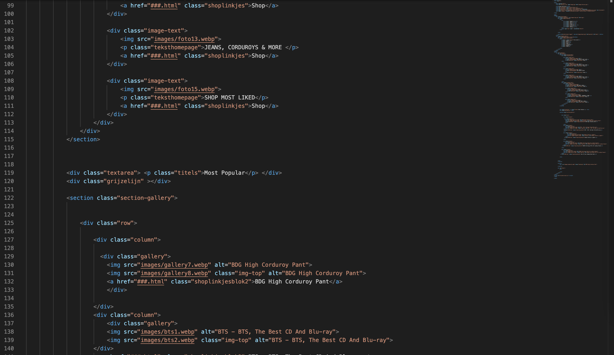

# Procesverslag
Markdown is een simpele manier om HTML te schrijven.  
Markdown cheat cheet: [Hulp bij het schrijven van Markdown](https://github.com/adam-p/markdown-here/wiki/Markdown-Cheatsheet).

Nb. De standaardstructuur en de spartaanse opmaak van de README.md zijn helemaal prima. Het gaat om de inhoud van je procesverslag. Besteedt de tijd voor pracht en praal aan je website.

Nb. Door *open* toe te voegen aan een *details* element kun je deze standaard open zetten. Fijn om dat steeds voor de relevante stuk(ken) te doen.

## Jij

uitwerken voor kick-off werkgroep

### Auteur:
Melissa Roquas

#### Je startniveau:
Blauw

#### Je focus:
Surface plane
 

## Je website

uitwerken voor kick-off werkgroep

### Je opdracht:
link website: https://www.urbanoutfitters.com/

#### Screenshot(s) van de eerste pagina (small screen): 
Muziek pagina 

#### Screenshot(s) van de tweede pagina (small screen):
Product pagina

 

## Breakdownschets (week 1)

uitwerken na afloop 2e werkgroep

### de hele pagina (mobile): 

### pagina 2 (product) (mobile)

### de hele pagina: 

### section van homepage: 

### pagina 2 (product)

### dynamisch deel (bijv menu): 

## Voortgang 1 (week 2)

uitwerken voor 1e voortgang

### Stand van zaken

Ik vond het lastig om met mijn opdracht te starten. Ik heb sinds vorige jaar niks meer met codes gedaan dus ik moest wel weer even wennen. Het gaat elke werkgroep wel weer beter maar toch blijft het moeilijk. Coderen voelt voor mij echt als een soort wiskunde. Toch heb ik wel hoop dat het goed komt met mijn eindopdracht. Ik maak veel aantekeningen tijdens de lessen en zoek veel bronnen op voor meer info. Ik ben van plan om in de weekenden eraan te werken en hulp te vragen wanneer nodig is.

Ik denk dat het voor mij verstandig is om elk onderdeel rustig aan te pakken en pas verder te gaan als het gelukt is. Ik merk namelijk soms dat ik te snel wil gaan om zo veel mogelijk content te coderen (zodat ik niet in tijdnood kom), maar ik zie dat het nu ook belangrijk is dat de content wel goed en netjes gecodeerd moet zijn. 

Ik ben sinds 24 november begonnen. Ik ben op dit moment bezig met de header.

### Agenda voor meeting
Samen met je groepje opstellen
Sharon, Daniel en ik zitten samen in een groepje waar we voor vormgeving en FED samen vragen bespreken voor de meetings. In de Whatsappgroep hebben we met elkaar gesproken en de vragen opgesteld. Vanwege een afspraak doe ik deze les mee met groepje A maar toch vond ik het belangrijk om even de vragen te kunnen stellen zodat we als team volgende meeting wel op dezelfde lijn zitten.

Vragen:
- Hoe kun je het beste beginnen met je website responsive maken, zijn hier tips voor?
- Hoe maak je de font size responsive?
- Hoe maak ik een hamburgermenu?
- Hoe kan ik het beste foto's (content) in mijn website zetten, zijn hier tips voor?
- Is er een schema/stappenplan aanwezig/wat is het slimste om als eerste mee te beginnen?

## Voortgang 2 (week 3)

uitwerken voor 2e voortgang

### Stand van zaken

Vorige week had ik alleen de header en nav afgemaakt. Deze week ben ik iets verder, ik heb de foto's met een grid in mn site gezet. Vanwege persoonlijke omstandigheden deze week heb ik minder tijd aan FED kunnen besteden dan op de planning stond, hierbij mis ik ook het feedback gesprek deze vrijdag. Op dit moment loop ik met coderen niet tegen veel dingen aan, ik moet alleen het tempo een verhogen voor de deadline.  Ik heb wel met Daniel en Sharon gesproken via Whatsapp of we nog vragen hadden. Sharon had een aantal vragen die ze graag wilt weten tijdens de meeting.

Responsive:

## Toegankelijkheidstest (week 4)

uitwerken na test in 8e voortgang

### Bevindingen
Lijst met je bevindingen die in de test naar voren kwamen:

#### Beperking - Spasme/Parkinson
Korte omschrijving: Het apparaatje gaf veel schrokken op mn arm waardoor ik niet goed op mn site kon focussen. Door de trillingen kon ik niet goed scrollen en klikte ik per ongeluk op sommige afbeeldingen (terwijl het niet de bedoeling was). 

Oplossingen:
- Scrollen door middel van een knop, want scrollen ging heel lastig omdat de hand niet normaal het trackpad kan bedienen
- In en uitzoomen aanpassen

#### Berperking - Afleiding 

Korte omschrijving:  Nina heeft de tekst op mijn site getest. We hebben gekeken naar concentratie problemen dat de gebruiker kan hebben tijdens het gebruiken van de website. We hebben gemerkt dat de afbeeldingen heel groot zijn op de homepage. Toen nina met de ballon in de luch aan het spelen was scrollde ze langs de foto’s. Ik vroeg vervolgens aan haar of ze nog wist wat de eerste afbeelding was. Ze zei dat het iets met make up was, maar dit klopte niet. Ze gaf toe dat ze het lastig vond om te onthouden wat er op de pagina stond.

Oplossing: Minder grote afbeeldingen met minder drukke kleuren.

#### Berperking - Slecht zicht (brillen)

Korte omschrijving: Nina en ik hebben samen een aantal brillen gebruikt waar we verschillende beperkingen aan het oog konden testen. Nina heeft mn pagina gekeken, ze had bij alle brillen een probleem met de grootte van de afbeeldingen. Voor haar was het niet helemaal duidelijk dat de pagina een webshop was omdat het meer op een fotogallerij lijkt. De kopjes en broodtekst zijn niet goed te zien.

Oplossing: Grotere koppen en broodtekst op de pagina

#### Voice-over
Korte omschrijving: Ik heb de voice-over van mijn computer aangezet en ben gaan testen op mijn eigen pagina. De volgorde van de voice-over ging prima. Ik merkte wel dat hij tijdens mijn ‘verborgen’ hamburger menu ook alle linkjes opgenoemd werden. Dit was wel vervelend omdat deze niet op de pagina te zien zijn. Ook merkte ik dat ik veel unlabelde foto’s had, hierdoor weet de gebruiker niet wat er op de pagina te zien is. Dit is super vervelend voor de gebruiker.

Tijdens de les is Sanne langs me gelopen, hij heeft samen met mij besproken dat mijn foto gallery (met wisselende foto) niet heel gebruiksvriendelijk is. Hij gaf aan om hier een oplossing voor te bedenken, deze oplossing hoeft niet in mijn eindopdracht.

Oplossing: Overal alt texts toevoegen

#### Alleen toetsenbord gebruiken
Korte omschrijving: Ik heb de “tab” optie op mijn toetsenbord gebruikt om te kijken wat er precies geselecteerd werd op mijn site. Alle linkjes werden geselecteerd maar de focus state heb ik nog niet in mijn site toegepast. Op dit moment zie ik alleen de kleur van het Apple systeem (roze).

Oplossing: Focus state toevoegen

## Voortgang 3 (week 4)

uitwerken voor 3e voortgang

Ik heb deze week gewerkt aan mijn grid en gallery. Ik ben best trots dat het gelukt is want het duurde heel lang. Ik maak me wel een beetje zorgen dat ik mijn eindopdracht niet af ga krijgen. De deadline komt wel heel dichtbij en ik heb nog maar de helft van mijn homepage af waar ook nog dingen veranderd aan moeten worden. Alle afbeeldingen zijn nu webp en ik moet deze nog omzetten naar png. Daarnaast is mijn code nog een rommel en staan er veel overige dingen in die nog verbeterd moeten worden. Ik ben wel een beetje zenuwachtig voor mijn feedbackgesprek.

In de Whatsapp groep heb ik nog aan Sharon en Daniel gevraagd of ze vragen hadden. 

### Stand van zaken

Responsive:

De code:

### Agenda voor meeting
Voor deze meeting hadden we geen agenda. Sharon en ik hebben allebei onze code laten zien aan Deanne en Yunus.

### Verslag van meeting
Dit gesprek was een beetje confronterend voor mij. Ik was vorige week vanwege omstandigheden niet bij het gesprek dus heb ik geen feedback kunnen krijgen op mijn code. Deze week liet ik mijn code zien maar het was niet goed. Ik had veel DIV’s gebruikt die er allemaal uit moesten. Daarnaast klopte heel veel dingen niet en moet ik meer met meer selectoren werken. Ik moet wel toegeven dat ik mijn code ook nog niet had ‘opgeschoond’ dus er zaten nog veel te veel extra dingen in die er nog uit moesten. Daarnaast was mijn CSS bestand ook nog best wel rommelig. Ik had zo veel mogelijk proberen te maken maar merkte dat ik beter stapje voor stapje mijn werk kan aanpakken. Deanne en Yunes hebben goed feedback gegeven, ze gaven aan dat ze wel hard voor me waren maar ik moet eerlijk toegeven dat ik dat wel even nodig had. Sanne kwam ook nog in een meeting. Deanne gaf aan mij aan dat ik beter alles naar mobile first kon zetten. Ik dacht namelijk dat mobile first alleen voor de studenten was die hadden gekozen voor de responsive kant. Sanne gaf aan dat ik mijn eerste pagina wel voor desktop mocht houden als ik al mn DIV's zou weghalen. Ik had ook 2 menu's in mijn pagina, namelijk de mobile en desktop versie. Ik moest van deze menu's één menu maken.

## Eindgesprek (week 5)

uitwerken voor eindgesprek

### Stand van zaken
Na het laatste feedback gesprek had ik nog een halve week om aan mijn code te werken. Deanna had aangegeven dat ik al mijn DIV's eerst moest weghalen. Dit heb ik gelijk gedaan maar mijn hele code moest opnieuw geschreven worden. Ik moet toegeven dat dit heel stressvol was en ik me slecht voelde omdat ik hard aan mn grid en gallery had gewerkt. Vervolgens heb ik mijn HTML en CSS opgeschoond en overige dingen weggehaald. Ik heb aan mijn collega van werk een aantal vragen gesteld hoe ik het beste het grid en hamburgermenu kon aanpakken. Hij had een lijstje genoteerd naar dingen waar ik online naar kon kijken. Ik ben daarna hard aan de slag gegaan met een oplossing te zoeken om mijn grid zonder DIV's te maken. Dat is uiteindelijk gelukt. Vervolgens heb ik hard aan mijn hamburger menu gewerkt dat goed gelukt is. 

Het is mijn uiteindelijk niet gelukt aan mijn tweede pagina te werken. Ik ga vragen bij het gesprek of ik van website mag wisselen want de Urban Outfitters website vind ik echt te moeilijk om uit te werken. Als ik ook naar de broncode kijken van Urban Outfitters zit dit vol met DIV's dus ik heb geen idee hoe ik dit met andere selectoren moet maken. Ik heb er veel tijd ingestoken maar toch is het me niet gelukt om de eerste pagina af te ronden voor de deadline.

### Screenshot(s)

 

## Eindgesprek & herkansing Picnic website

 

uitwerken voor eindgesprek

Voor het eindgesprek heeft Sanne mij een berichtje gestuurd hoe ik het beste de website van Urban Outfitters kon aanpakken. Tijdens het gesprek heb ik aangegeven dat ik toch liever de website van Picnic wil maken. Deze site lijkt mij makkelijk en hierbij kan ik me meer focussen op de surface plane inplaats van de responsive kant. 

### Picnic menu

De website van Picnic heeft geen hamburger menu. Daarom heb ik besloten om deze zelf te designen en te coderen.

#### Breakdownschets Picnic website

Om het coderen makkelijker te maken heb ik opnieuw breakdown schetsen gemaakt.

##### Uitwerking Picnic website

Pagina 1 - Homepage

Pagina 2 - Contact

Hamburgermenu

## Bronnenlijst (Urban Outfitters site)

continu bijhouden terwijl je werkt

1. How to change image on hover with CSS (https://www.tutorialrepublic.com/codelab.php?topic=faq&file=css-image-swap-on-hover)
2. CSS Grid Template Areas In Action (https://ishadeed.com/article/grid-area/)
3. addEventListener vs onclick (https://stackoverflow.com/questions/6348494/addeventlistener-vs-onclick)
4. Van Deanna - Border-bottom (https://developer.mozilla.org/en-US/docs/Web/CSS/border-bottom)
5. Van Deanna - article: The Article Contents element (https://developer.mozilla.org/en-US/docs/Web/HTML/Element/article)
6. States - https://codepen.io/shooft/pen/gOrJdGG
7. Grid - https://codepen.io/shooft/pen/abwLwRO
8. Why use * selector in combination with *::before and *::after (https://stackoverflow.com/questions/31317238 why-use-selector-in-combination-with-before-and-after)
9. Box alignment in CSS Grid Layout (https://developer.mozilla.org/en-US/docs/Web/CSS/CSS_Grid_Layout/Box_Alignment_in_CSS_Grid_Layout)
10. Vragen gesteld aan mijn collega Pim (over Grid) & Javascript Hamburgermenu
11. EventTarget.removeEventListener() https://developer.mozilla.org/en-US/docs/Web/API/EventTarget/removeEventListener

## Bronnenlijst (Picnic site)

continu bijhouden terwijl je werkt

1. CSS :nth-of-type() Selector (https://www.w3schools.com/cssref/sel_nth-of-type.asp)
2. FED 21/22 - Flexbox - Oefening 2 (https://codepen.io/melissamroquas/pen/mdMvGWj)
3. CSS box-shadow Property (https://www.w3schools.com/cssref/css3_pr_box-shadow.asp)
4. translateY() (https://developer.mozilla.org/en-US/docs/Web/CSS/transform-function/translateY())
5. scroll-snap-type (https://css-tricks.com/almanac/properties/s/scroll-snap-type/#:~:text=scroll%2Dsnap%2Dtype%20accepts%20the,along%20the%20x%2Daxis%20only.&text=mandatory%20is%20a%20strictness%20value,there%20isn't%20scrolling%20happening.)
6. Horizontal scrollable slider with visible overflow (https://stackoverflow.com/questions/66808995/horizontal-scrollable-slider-with-visible-overflow)
7. CSS Forms (https://www.w3schools.com/css/css_form.asp)
8. CSS background-image Property (https://www.w3schools.com/cssref/pr_background-image.asp)
9. <input type="submit"> (https://developer.mozilla.org/en-US/docs/Web/HTML/Element/input/submit)
10. CSS The !important Rule (https://www.w3schools.com/css/css_important.asp)

